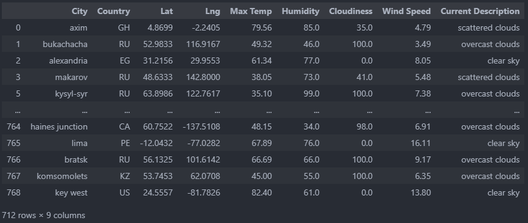
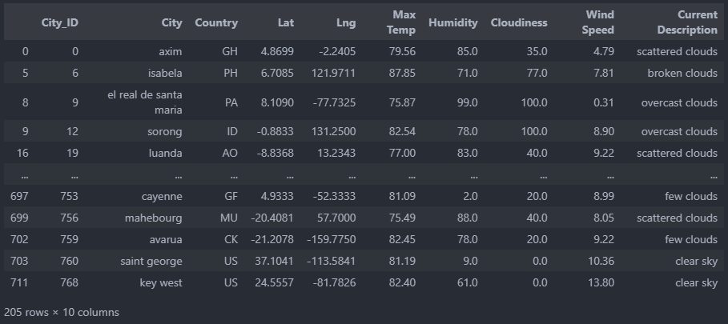
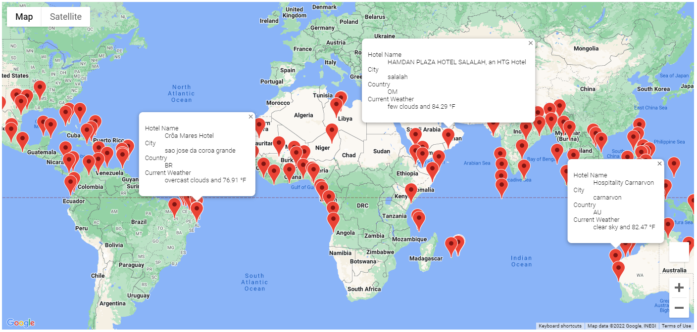
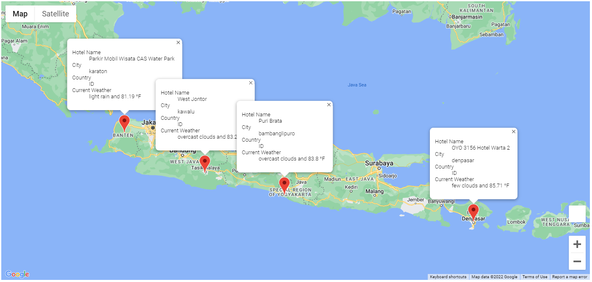
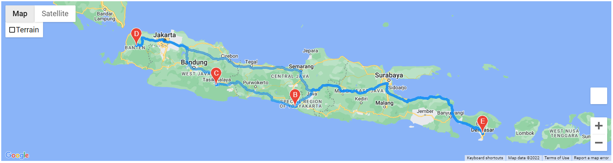

# WeatherPy
Code for an app that retrieves travel destinations and creates travel itineraries based on user input

## Overview
The code in this project could be used to create an app or otherwise facilitate a travel agent style service. It makes use of two APIs, [OpenWeatherMap.org](OpenWeatherMap.org) for weather data and the [Google Maps Platform](https://mapsplatform.google.com/) for hotel names and directions. Basically it creates a csv of random cities and finds the weather data for them, narrows down the selection based on preferred temperature range, and can create a vacation itinerary including four different cities within the user set temp range.

## Project breakdown

### Weather DataBase
The code involving the building of the initial dataset is in the folder Weather_Database. 2000 random longitude and latitude values are generated and using the [citipy](https://github.com/wingchen/citipy) module we find the closest cities of a certain size to each point. 

After this we use the OpenWeatherMap API to collect the current weather data from every city. Since not every city we find using the citipy module has data on OpenWeatherMap, 200 queries gives us about 700 or so cities. Below is one dataset that can be generated using this system, which happens to be the one we'll use for further analysis below.

As one can see above, each city is matched with relevant current (at the time of the API calls) weather attributes.

### Vacation Search

All code involving narrowing down the selection by temperature and finding hotel results are in the Vacation Search directory. Basically when vacation_search.ipynb is ran, the user is prompted to give a minimum and maximum temperature. The database of cities created in weather_database is narrowed down to only cities that have max temperatures in that range. For the examples below, I used 75 to 90 as the range, giving us a distribution mostly along the equator. Note that there are only 205 rows below despite the original city indexes on the left ending in 768.

After this, I looped through each city in the new filtered cities dataset and made a Google Maps Platform API call to get a hotel from each one. Here, only the first hotel from all results is taken, but this search could be expanded or narrowed down in many ways by altering the API calls. After putting this data into a map we get a result that looks like the image below.

The data was also exported to csv to be used in the vacation itinerary builder code below.

## Vacation Itinerary 

All code involving creating the travel itinerary is done in the Vacation_Itinerary directory. Here, we have the freedom to choose cities out of the dataset we created in Vacation_Search, and for this example I chose 4 nearby cities in Indonesia.

Finally, using the Google Maps Platform API, I made a call to get the directions for a round trip from the starting city with 3 stops along the way.

